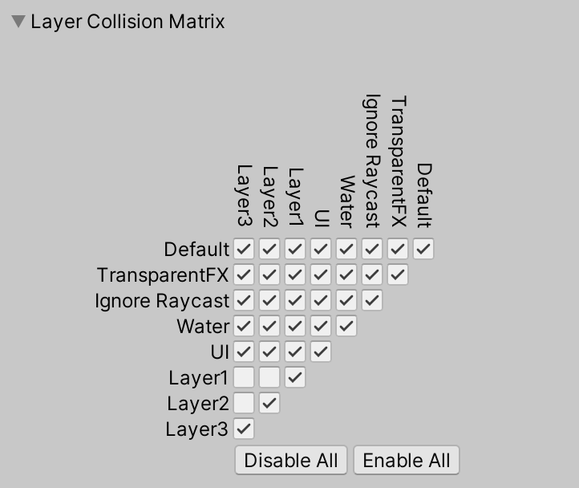

# Unity 测试项目

## 预先说明
1. 此为测试用 U3D 项目，仅为了学习和测试一些功能。美术资源均来自网络。
1. 推荐使用[这个](https://github.com/HxxWorkAccount/Markdown-CustomCSS-GoogleStyle) Markdown 配置。
1. 现实中的 2D 风格游戏通常还是基于 3D 场景实现，这是为了解决复杂的深度和光照问题。

## 项目同步
Unity 的项目同步主要是上传 Assets 文件夹和 ProjectSettings 文件夹。ignore 文件看 .gitignore 列表。

## Layer
2D 风格中的 Layer 处理非常麻烦，有好几个问题。

- 多层次场景：通常用 Sorting Layers，然后在指定所在的层次。
  

- 场景碰撞体问题：为了避免不同层次的场景发生碰撞，需要在 Project Setting 中手动调整：
  

  这还会造成一些麻烦，比如墙壁等，每个 Sorting Layer 都要重新设置一份，而且玩家在 Sorting Layer 之间移动时，要加上碰撞检测并自动设置更改玩家的 Sorting Layer。
- 2D 遮挡：这通常通过改变深度轴来实现，但仅适合那些垂直方向的 2D 游戏，如果是侧面望下去的 2.5D，依然不适用这种方法：
  

## Sprite 配置
对于 2D 游戏，特别是像素风格的游戏，有几点设置非常重要：

具体含义可以查看 Unity Documentation。

### Atlas 优化
把经常同时出现的 Sprite 放到一个 Atlas 里，就可以自动优化并减少 Drawcall，这点常用于 UGUI。

## Tilemap
对于地面、墙壁这类的地图部分，通常用 Tilemap 来制作。

## ScriptableObject
ScriptableObject 主要有两大功能：
1. 配置文件。
1. 不同组件之间同步共享数据，实现数据和行为分离。关于这点在 Unity Open Project 中有广泛应用，可以去那里查看。

例子：

## 相机
通过 `Vector3.Lerp` 来实现平滑跟随，具体不解释。

## 基于刚体的角色控制器
- 也就是使用 Rigidbody2D 来移动对象，使用时务必关闭重力并把 Gravity Scale 设为 0。
- 再在代码中修改 Velocity 属性即可。

## 2D 光照
- 要给游戏中的 Sprite 添加材质：
  

  这样才会被光照影响。
- 如果在场景中使用多个光源，需要在 Project Setting 中设置：
  

效果：

## 2D 动画和动画状态机
Sprite 的动画比起 3D 模型来说非常简单，直接把连续的 Sprite 拖入 Animation 即可。

为了实现更精准的伤害触发，通常把依赖动画的事件放到动画事件上，这样动画播放到某帧的时候就会自动执行该方法：

状态机会比较复杂：

攻击帧伤害触发：

## 基于范围检测的触发器
Unity 提供了非常良好的碰撞检测，但需要依赖钢体（两个碰撞对象上，至少有一个要含有钢体），有时候非常麻烦，这时候就可以手写一个用范围检测做的触发器。

为了更良好的设置，还需要重写 OnInspector：

另外还要支持 Gizmos 显示碰撞范围：

> 这里关于 Capsule 的碰撞范围显示我用了两个球来代替，但是经过测试和实际的碰撞范围有一定的出入，目前没找到原因

## 插件：A* Pathfinder
这是 2D 开发 AI 时必不可少的插件。

## 插件：Dotween
